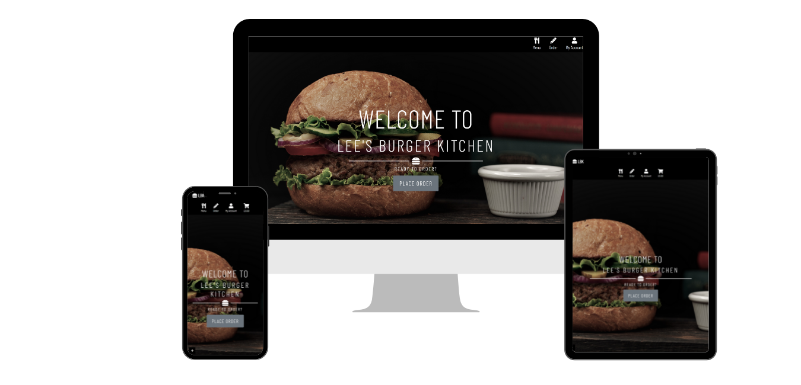

# MSP4 Lee's Burger Kitchen (LBK)



This is the Website for [Lee's Burger Kitchen(LBK)](). Which is an online burger delivery site. 

The purpose of this site is to use everything learnt from all the modules of the Full Stack Developer Course and create a Full Stack 
Django Framework project that includes the accessing, manipulating and displaying data retrieved from a relational database. 
The Website utilises a PostGres database together with Python code to access and manipulate the data. 

HTML, CSS and Javascript were used to help assist the Django frameworks with the visualization of the data. The site utilises the UI feature called Stripe which allows online payments.

------

# User Experience (UX)

## User stories
### Common user stories (guests, new users and authenticated users)

As a User....
*  I expect to access the website from any device, so that I can use the website anytime and anywhere.
*  I expect to easily navigate the website, so that I can quickly find what I'm looking for.
*  I want to find an information about the company, to know what they do, what their main principles and ideas
*  I want to see the location of the LBK.
*  I want to be able to easily contact the owner/manager of the company, so that I can write an additional query or ask a question.
*  I want to view all available products.
*  I want to view product details (e.g. image, price, description, ingredients), so that I can make an informed decision before I buy.
*  I want to search and filter the products easily, so that I can quickly find a specific product I am looking for.
*  I want to view and modify my order in the cart before completing it, so that I can make last changes easily before proceeding to payment.
*  I want to view a total price of my purchases and delivery cost, so that I will understand and see how much I will be charged.
*  I want to receive an email confirmation after checkout, so that I can make sure that payment was successfull.


### New Users
As a new user....
* I want to create my own account, so that I can save, view and edit my profile details and view my order history.

### Returning users
As a returning user....
*  I want to easily login anytime, so that I can get access to my saved profile details and make next purchase quicker.
*  I want to reset my password if I forgot it, so that I can get access to my profile again.
*  I want to be able to change my password, so that I can create the stronger password to protect my personal details.
*  I want to be able to change my email.
 
### Website Owner(admin)
As a Site owner....
*  I want to secure admin interface avalable only for website admin, so that I can add, edit and remove products.
*  I want to be able to view orders recieved  for that day and update the order status.
*  I want to be able to differentiate between active orders and completed orders for the day.
*  I want to be able to view history of all orders received.   

## Design

### Frameworks

- Bootstrap, front-end framework was chosen for this project for its ease of use and ability to be easily customized. 
It was used for creating features such as navbar, cards, forms, modals, as well as for the layout.
- JQuery is used for initializing some Bootstrap components.

### Colour Scheme

The main goals of UI is to focus the user's attention on the product images therefore simple greys, whites and blacks where used to create
a clean and neat background. 


### Typography 
    
The Font Barlow Condensed was used from google fonts accross the site as its a clean and simple font.

### Icons
        
Icons from fontawesome where used throughout the site as the grab the users attention. They create a more user-friendly experience for 
users as they give visual clues about the subject. Icons used across the project for social media links, forms, cart, search bar and the 
navigation are similar to what the user would see in other sites giving them a sense of familiarity.

### Imagery  

The main image has been chosen to be eye catching and gives the user a clear indication of what the website is about.
The other images have been choosen to highlight the product in an appealing light.  
    
    
## Wireframes:
The [LBK](documents/docs/LBK.pdf) wireframes can be found here.
 
------

# Features

## Existing Features

### Home page 
- The homepage welcomes users to the site with a hero image, text and place order button which indicaates the purpose of the site. further down the page the user can find sections about our burgers, about us, our ingredients, and reviews section. Each section contains, imagery relavant to the section, a brief but informtive narative about the section and a button to take user to that view. 


#### Our Burgers
 - Our Burgers gives a brief explanation about our burgers with a button to the menu page.
 

#### About Us
 - The about us page gives users a little story of who we are, why we are different, delivery info and costs and contact details.
 

#### Our Suppliers 
- Our suppliers page gives users breif narrative about our ingredients and providers with links to their sites.
 

#### User Reviews 
- The reviews page has a brief narrative informing the users that these are customers reviews of LBK and displays the reviews in a accordian style list displaying review title and date of review the drop down reveals the review, rating, user name, and date. Users are encouraged to click and add review.  

#### Add review 
- When users click to add a review they are asked to sign in or register if not already, the user name is displayed at the tom and they are asked to leave a title, select a rating from 1 to 5 and leave a comment.
 

### Footer 
- The footer has links to social media accounts these are defaulted to the homepage of the social media platform as no accounts exist for LBK. Opening and closing times and a link to homepage are also included.
 

### Logo 
- The LBK logo is a subtle burger and initial logo which acts a link to the homepage.

### Navbar 
- The Navbar allows users an easy navigation through the site for registered and non-registered users. 
 
Some navigational links have access only for authenticated users or superusers and is accessible on all pages, the Navbar links consist of Menu, Order, Admin, My Account and Checkout.
 

#### Menu
- Menu in the Navbar takes user to the products page, which displays all products in cards format. When the card image is clicked or hovered on the card displays the product name description and more info button for all users, for superusers edit and delete buttons are visible. Included on this page is a search functionality that allows users to search for products based on name and description. Users can filter products based on category type which returns all products in that category.  
 

#### Product Details 
- When user clicks on the more info the product details appear which displays name, price, category, ingredients and if sutible for vegetarians. Non authenticated users see an option to login or register to place order, authenticated users can add quantity and add to cart. Superusers also have button options to edit product details or delete product.  

#### Order
- Order in the navbar has a dropdown option that allows users the options to place an order, view customer burgers and create a custom burger.   

#### Place Order 
- Place order allows authenticated users to view a list of all products split by category, adjust the quantity and add to cart. 
 
* Build your Own - Custom burgers view allows the users to view all customer burgers created by other users and to create their own.
 

#### Create your own 
- Create your own view allows users to create their own brger and add to cart. The ingredients are split by category and the user can choose what they want in their burger as well as give it a creative name.
 

#### Cart
- The shopping cart displays the product details that have been added to the cart the user can see product image, name, price, quantity, subtotal, cart total, delivery costs and grand total. the user can continue shopping or checkout.
 

#### Checkout Page 
- The checkout page utilises Stripe to process user payments, this page has order summary, client details, delivery info and payment info. The Client details and delivery info are populated from the user profile if completed or if they have ticked the option to save delivery info on previous transactions. The payment info uses stripes standard layout of card number, expiry, cvc and also displays error notification regarding card details. Once user clicks secure checout the user is the greeted with a custom loading page followed by a order confirmation, containing order info, order details, delivery info and billing info and a email confirmation is sent to the email address provided.
     

### My Account
#### Profile Page 
- The authenticated user profile page is accessed from My Account in the navbar, this displays the users profile name, profile picture, username, email, delivery info and order history, which the user cand click on to see the past order confirmtion details 


#### Update Profile details 
- User can update their username, email, profile picture and delivery info. 
 

#### Order History 
- The Order history gives a brief overview of the order order number, date, status, items and total. Users can click on order number to view the confirmation order.
 

### Admin
- The admin section in the navbar allows store owners the ability to add products, see the orders for that day and all orders.

#### Add Product
- The add product allows superusers the abillity to add new products via a form to the database by completing the relevant fields.
 

#### Todays Orders Dashboard 
- Todays orders shows the store owner a breakdown of total revenue and a count of how many orders have been recieved that day. Underneath this is two tables one for active orders and the other for completed orders. The tables display basic information about the order id, total, order at, name, email and status. When the row is clicked on the complete order details are displayed.
   

#### Order Details/Status Update 
- The order details display the order info and status which can be updated by store owner to order recieved (default), order cooking, out for delivery and delivered. When order is updated to delivered the order is moved from the active table in the order dashboard to completed.
 

#### Order History 
- The Order history allows the store owner the ability to see all orders and has the ability to serach all orders for the name, id, email, status and ordered on that way if a custome complains the owner can search his order and pull up the order information.
 

### Django All Auth
#### Sign Up 
- The sign up allows new users to register and create a profile by completing the registration form.
 

#### Login 
- Allows registered users the ability to sign in. 
 

#### Forgot Password 
- Allows users the ability to reset their password.

#### Logout 
- Allows the users to logout.

### Back to Top 
- Features on the right hand side of the screen and allows the users the ability to return back to top of the screen.

## Future Development
* Order Delivery tracker - Allows useres the ability to track their order. 
* Apple & Google Pay - Allows the users to pay using Apple pay or Google Pay.
* Social Account Login feature - Allows user the ability to sign in with their social accounts such as facebook.
* Voting buttons - Allows the users the ability to vote if they like the custom burger. After so many votes the burger is then addded to the main menu.
* Functionality in the custom burgers to allow/restrict users the ability to double up on burgers for an additional price. 

------
# Database Structure

**Sqlite3** database was used during the developmental phase which wass installed with Django. **PostgreSQL** database was used when deployed to Heroku.

The database consists of 8 models as detailed the relationships between the models is displayed [Relationship Diagram](documents/docs/DBmodels-Relationship.pdf) can be found here.

## Data Models
### Profiles App
#### UserProfile
| **Database Key** | **Field Type** | **Validation** |
 --- | --- | --- 
user | OneToOneField(User) | on_delete=models.CASCADE
image | ImageField | default='default.jpg', upload_to='profile_pics'
default_phone_number | CharField | max_length=20, null=True, blank=True
default_street | CharField | max_length=80, null=True, blank=True
default_town_or_city | CharField | max_length=40, null=True, blank=True
default_county | CharField | max_length=80, null=True, blank=True
default_postcode | CharField | max_length=20, null=True, blank=True

### Products App
#### Category
| **Database Key** | **Field Type** | **Validation** |
 --- | --- | --- 
name | CharField | max_length=254
friendly_name | CharField | max_length=254, null=True, blank=True

#### Product
| **Database Key** | **Field Type** | **Validation** |
 --- | --- | --- 
category | ForeignKey('Category') | null=True, blank=True, on_delete=models.SET_NULL
name | CharField | max_length=254
description | TextField |
price | DecimalField | max_digits=6, decimal_places=2, null=True, blank=True
image_url | URLField | max_length=1024, null=True, blank=True
image | ImageField | null=True, blank=True
vegetarian | BooleanField |
ingredients | ManyToManyField('Ingredients') | related_name='ingredients', blank=True
custom | BooleanField | default=False


#### Ingredients
**Database Key** | **Field Type** | **Validation** |
--- | --- | --- 
name | CharField | max_length=30
cat | CharField | max_length=100, null=True, blank=True


#### Custom_Burger
| **Database Key** | **Field Type** | **Validation** |
 --- | --- | --- 
custom_name | CharField | max_length=254
buns | ManyToManyField('Ingredients') | related_name='buns', blank=True
burger | ManyToManyField('Ingredients') | related_name='burger', blank=True
sauce | ManyToManyField('Ingredients') | related_name='sauce', blank=True
salads | ManyToManyField('Ingredients') | related_name='salads', blank=True
cheese | ManyToManyField('Ingredients') | related_name='cheese', blank=True
extras | ManyToManyField('Ingredients') | related_name='extras', blank=True
category | ForeignKey('Category') | null=True, blank=True, on_delete=models.CASCADE, related_name='custom_burger'
price | DecimalField | max_digits=6, decimal_places=2, default='10.99', editable=False

### Customer App
#### Review
| **Database Key** | **Field Type** | **Validation** |
--- | --- | --- 
user | ForeignKey(User) | on_delete=models.CASCADE
date | DateTimeField | auto_now_add=True
title | TextField | max_length=500, blank=True, null=True
comment | TextField | max_length=2500, blank=True, null=True
rate | PositiveSmallIntegerField | choices=RATING_CHOICES

RATING_CHOICES =  (1, '1 - Awful'), (2, '2 - Could be Better'), (3, '3 - OK'), (4, '4 - Good'), (5, '5 - Amazing'),

### Checkout
#### Order
| **Database Key** | **Field Type** | **Validation** |
--- | --- | --- 
created_on | DateTimeField | auto_now_add=True
order_id | CharField | max_length=32, null=False, editable=False
user_profile | ForeignKey(UserProfile) | on_delete=models.SET_NULL, null=True, blank=True, related_name='orders')
name | CharField | max_length=50, blank=False
email | EmailField | max_length=250, null=False, blank=False
phone_number | CharField | max_length=20, null=False, blank=False
street | CharField | max_length=80, null=False, blank=False
town_or_city | CharField | max_length=50, null=False, blank=False
postcode | CharField | max_length=20, null=False, blank=False
county | CharField | max_length=80, blank=True
delivery_cost | DecimalField | max_digits=6, decimal_places=2, null=False, default=0
order_total | DecimalField | max_digits=10, decimal_places=2, null=False, default=0
grand_total | DecimalField | max_digits=10, decimal_places=2, null=False, default=0
order_status | CharField | max_length=100, choices=CHOICES, default='Order Recieved'
original_cart | TextField | null=False, blank=False, default=''
stripe_pid | CharField | max_length=254, null=False, blank=False, default=''

CHOICES = [('Order Recieved', 'Order Recieved'), ('Cooking', 'Cooking'), ('Out for delivery', 'Out for Delivery'), ('Order Delivered', 'Order Delivered'),

#### OrderLineItem
| **Database Key** | **Field Type** | **Validation** |
 --- | --- | --- 
order | ForeignKey(Order) | null=False, blank=False, on_delete=models.CASCADE, related_name='lineitems'
product | ForeignKey(Product) | null=False, blank=False, on_delete=models.CASCADE
quantity | IntegerField | null=False, blank=False, default=0
lineitem_total | DecimalField | max_digits=6, decimal_places=2, null=False, blank=False, editable=False


------

# Technologies Used
 
 **Languages** 
- HTML
- CSS
- Python
- Javascript
- Jinja
 

**Libraries & Frameworks**
   
[Django](https://www.djangoproject.com/):
 Django Framework was used to create this project. 

[Bootstrap](https://getbootstrap.com/):
 Bootstrap was used throughout the site to help design and customize and help with 
 
[Font Awesome](https://fontawesome.com/):
 Font Awesome was used to provide the Icons throughout this website.

[Google Fonts](https://fonts.google.com/):
 Google fonts was used to import the font into the style.css file

[JQuery](https://jquery.com/):
 JQuery was used to enable scripts 

[Pillow](https://pypi.org/project/Pillow/):
 Pillow was installed as imaging library for this project.
 
[Gunicorn](https://gunicorn.org/):
 Was installed and used as the webserver

[Psycopg2](https://pypi.org/project/psycopg2/):
 Psycopg2 was utilised as the PostgreSQL database adapter for the project.
 
[Stripe](https://stripe.com/gb):
 Stripe was used for the online payment processing when customer uses the checkout.
 
[Django Crispy Forms](https://django-crispy-forms.readthedocs.io/en/latest/):
 Django Crispy Forms was used to render the behavior of the forms in this project.

[Boto3](https://boto3.amazonaws.com/v1/documentation/api/latest/index.html):
 Boto3 was used along with AWS to create, configure, and manage AWS services.

[Django Storages](https://django-storages.readthedocs.io/en/latest/):
 Django Storages was used as the backend storages for connecting with S3

**Tools**

[Git](https://git-scm.com/): 
 Git was used by utilizing the Gitpod terminal to commit to Git and push to GitHub.

[GitHub](https://github.com/):
 GitHub was used to create a repository and store the code after it was pushed from Git.

[Pip](https://pip.pypa.io/en/stable/installing/):
 Pip was used to istall python packages/modules required for the project.

[Heroku](https://www.heroku.com):
 Heroku was used to deploy my app.

[AWS S3 Bucket](https://aws.amazon.com/):
 AWS S3 was used to store the static files and the images for the project.

[Balsamiq](https://balsamiq.com/):
 Wireframes were created using Balsamiq

[Pixabay](https://pixabay.com/):
 Pixabay was used to source the background imagery for the webpage and Burger Images.

[Istock](https://www.istockphoto.com/): 
 Istock was used to source the background imagery for the webpage and Burger Images.

[Pexels](https://www.pexels.com/):
 Pexels was used to source the background imagery for the webpage and Burger Images.

[Imgur](https://imgur.com/): 
 Was used to upload my images and create a url for the database upload.

[DBdiagram](https://dbdiagram.io/home):
 was used to create the database relationship diagram.
 
**Databases**

[SQlite3](https://sqlite.org/index.html):
 SQLite3 was used as the developmental database before deploying to Heroku.

[PostgresSQL](https://www.postgresql.org/):
 Postgres SQL was used as the relational database after to deploying to Heroku.

------
# Testing
Testing information can be found in a separate [TESTING.md](TESTING.md) file


------
# Deployment 

Lees Burger Kitchen was developed using [GitPod](https://www.gitpod.io/) using Git & GitHub for version control. 
It is hosted on the [Heroku](https://heroku.com/) platform, with static files hosted in AWS S3 Basket.

### Local Deployment
To be able to run this project, the following tools have to be installed:
- An IDE of your choice (I used [GitPod](https://www.gitpod.io/) for creating this project)
- [Git](https://git-scm.com/)
- [PIP](https://pip.pypa.io/en/stable/installing/) 
- [Python3](https://www.python.org/)    

Accounts will need to be created for the following services:
- [Stripe](https://stripe.com/en-ie)
- [AWS](https://aws.amazon.com/) to setup the [S3 basket](https://docs.aws.amazon.com/AmazonS3/latest/gsg/CreatingABucket.html)
- An Email account for this project I used [Gmail](https://mail.google.com/)

#### Directions
1. You can clone this repository directly into the editor of your choice by pasting the following command into the terminal:   
`git clone https://github.com/Leeap83/Lee-s_Burger_Kitchen.git`          

More information about the cloning process can be found here: [GitHub Help page](https://docs.github.com/en/github/creating-cloning-and-archiving-repositories/cloning-a-repository).   

2. Set up environment variables.     
Note, that this process will be different depending on IDE you use.   
In this it was done using the following way:      
    - Create `.env` file in the root directory.
    - Add `.env` to the `.gitignore` file in your project's root directory
    - In `.env` file set environment variables with the following syntax:     
    ```bash 
    import os  
    os.environ["DEVELOPMENT"] = "True"    
    os.environ["SECRET_KEY"] = "<Your Secret key>"    
    os.environ["STRIPE_PUBLIC_KEY"] = "<Your Stripe Public key>"    
    os.environ["STRIPE_SECRET_KEY"] = "<Your Stripe Secret key>"    
    os.environ["STRIPE_WH_SECRET"] = "<Your Stripe WH_Secret key>"    
     ```
    
3. Install all requirements from the **requirements.txt** file putting this command into your terminal:     
`pip3 install -r requirements.txt`     
4. In the terminal in your IDE migrate the models to crete a database using the following commands:    
`python3 manage.py makemigrations`     
`python3 manage.py migrate`     
5. Load the data fixtures(**categories**, **products**) in that order into the database using the following command:    
`python3 manage.py loaddata <fixture_name>`        
6. Create a superuser to have an access to the the admin panel(you need to follow the instructions then and insert username,email and password):    
`python3 manage.py createsuperuser`   
7. You will now be able to run the application using the following command:     
`python3 manage.py runserver`     
8. To access the admin panel, you can add the `/admin` path at the end of the url link and login using your superuser credentials.

### Heroku Deployment
The project was deployed to [Heroku](https://dashboard.heroku.com/apps) Pages using the following steps...

To deploy the project on heroku, take the following steps:

1. If not already present, create a requirements.txt file using the command:

    pip freeze > requirements.txt

2. If not already present, create a `Procfile` with the command:

    echo web: python app.py > Procfile

3. Push the the project to GitHub.

4. Log in to your Heroku account and create a new app on the [Heroku website](https://dashboard.heroku.com/apps) by clicking the 
"New" button in your dashboard. Give it a name and set the region to the one closest to you, then click the "Create app" button.

5.  Click on "Deploy" tab and under "Deployment method" and select GitHub. Select the correct repository and click "Connect".

6. Click on the "Settings" tab and under "Config Vars" click "Reveal Config Vars" and enter the Key and values stored in
the env.py file:
                 
| KEY            | VALUE         |
|----------------|---------------|
| AWS_ACCESS_KEY_ID | `<your aws access key>`  |
| AWS_SECRET_ACCESS_KEY | `<your aws secret access key>`  |
| DATABASE_URL| `<your postgres database url>`  |
| EMAIL_HOST_PASS | `<your email password(generated by Gmail)>` |
| EMAIL_HOST_USER| `<your email address>`  |
| SECRET_KEY | `<your secret key>`  |
| STRIPE_PUBLIC_KEY| `<your stripe public key>`  |
| STRIPE_SECRET_KEY| `<your stripe secret key>`  |
| STRIPE_WH_SECRET| `<your stripe wh key>`  |
| USE_AWS | `True`  |
  

7. In the "Manual Deployment" section of this page, make sure the master branch is selected and then click "Deploy Branch".

8. The site is now successfully deployed, click the "Open app" button to visit it.

------

# Credits

**Code**
* [Code Institute](https://codeinstitute.net/) The project's code was developed by following the video lessons for the Boutique Ado Django Mini-Project, but was customized, modified and enhanced to fit the project purposes. 
* Animation on the homepage was implemented following JulioCodes [Youtube](https://www.youtube.com/c/JulioCodes)
* Kevin Loughrey & Scott Kipp from tutor support for help with my "Server Error 500" error.

**Content & Media**

Burger Images and homepage images were downloaded from Pexels from the following Users:
* https://www.pexels.com/@taryn-elliott
* https://www.pexels.com/@valeriya
* https://www.pexels.com/@atomlaborblog
* https://www.pexels.com/@jonathanborba
* https://www.pexels.com/@seyed-ali-hosseini-1226419
* https://www.pexels.com/@geraud-pfeiffer

Istock Credits were purchased and images were downloaded from the following:
* https://www.istockphoto.com/portfolio/vaaseenaa?mediatype=photography
* https://www.istockphoto.com/portfolio/comicsans?mediatype=illustration
* https://www.istockphoto.com/portfolio/Fudio?mediatype=photography
* https://www.istockphoto.com/portfolio/bhofack2?mediatype=photography


**Acknowledgements**

* My Mentor Aaron Sinnott for feedback
* Code Institute for training
* Tutor Support for assistance with code errors
* Slack for reference on coding issues
* WS3 schools for reference on coding issues
* Stackoverflow for reference on coding issues
* YouTube online tutorials used when encountered coding issues