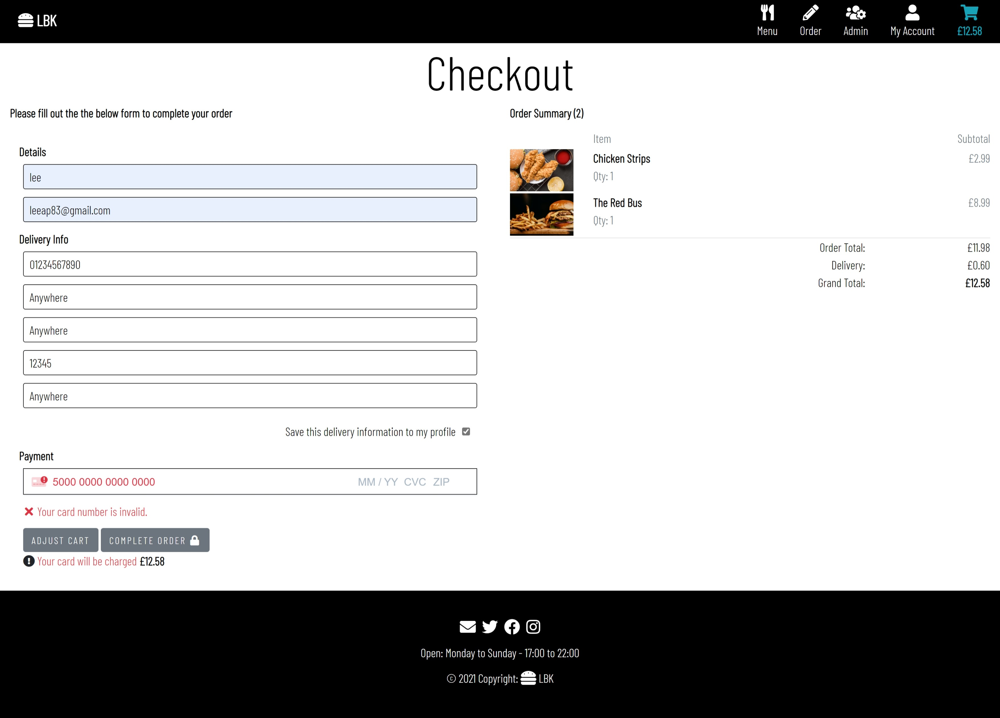
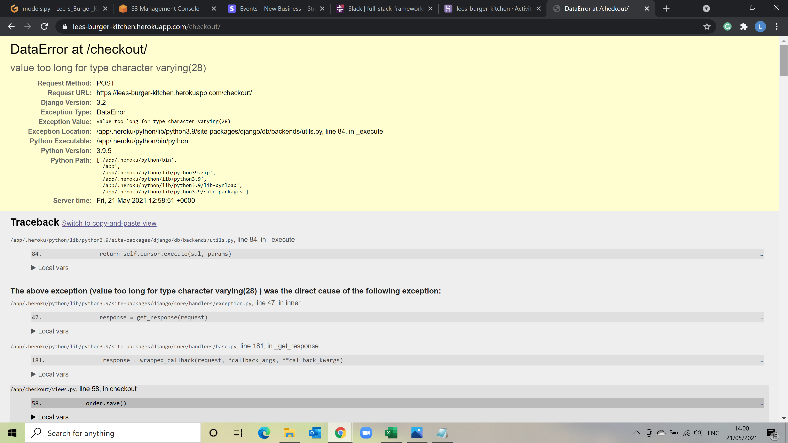

# MSP4 Lee's Burger Kitchen (LBK)


This is the Website for [Lee's Burger Kitchen(LBK)](). Which is an online burger delivery site. 

The purpose of this site is to use everything learnt from all the modules of the Full Stack Developer Course and create a Full Stack 
Django Framework project that includes the accessing, manipulating and displaying data retrieved from a relational database. 
The Website utilises a PostGres database together with Python code to access and manipulate the data. 

HTML, CSS and Javascript were used to help assist the Django frameworks with the visualization of the data. The site utilises the UI feature called Stripe which allows online payments.

------

# User Experience (UX)

## User stories
### Common user stories (guests, new users and authenticated users)

As a User....
*  I expect to access the website from any device, so that I can use the website anytime and anywhere.
*  I expect to easily navigate the website, so that I can quickly find what I'm looking for.
*  I want to find an information about the company, to know what they do, what their main principles and ideas
*  I want to see the location of the LBK.
*  I want to be able to easily contact the owner/manager of the company, so that I can write an additional query or ask a question.
*  I want to view all available products.
*  I want to view product details (e.g. image, price, description, ingredients), so that I can make an informed decision before I buy.
*  I want to search and filter the products easily, so that I can quickly find a specific product I am looking for.
*  I want to view and modify my order in the cart before completing it, so that I can make last changes easily before proceeding to payment.
*  I want to view a total price of my purchases and delivery cost, so that I will understand and see how much I will be charged.
*  I want to receive an email confirmation after checkout, so that I can make sure that payment was successfull.


### New Users
As a new user....
* I want to create my own account, so that I can save, view and edit my profile details and view my order history.

### Returning users
As a returning user....
*  I want to easily login anytime, so that I can get access to my saved profile details and make next purchase quicker.
*  I want to reset my password if I forgot it, so that I can get access to my profile again.
*  I want to be able to change my password, so that I can create the stronger password to protect my personal details.
*  I want to be able to change my email.
 
### Website Owner(admin)
As a Site owner....
*  I want to secure admin interface avalable only for website admin, so that I can add, edit and remove products.
*  I want to be able to view orders recieved  for that day and update the order status.
*  I want to be able to differentiate between active orders and completed orders for the day.
*  I want to be able to view history of all orders received.   

## Design

### Frameworks

- Bootstrap, front-end framework was chosen for this project for its ease of use and ability to be easily customized. 
It was used for creating features such as navbar, cards, forms, modals, as well as for the layout.
- JQuery is used for initializing some Bootstrap components.

### Colour Scheme

The main goals of UI is to focus the user's attention on the product images therefore simple greys, whites and blacks where used to create
a clean and neat background. 


### Typography 
    
The Font Barlow Condensed was used from google fonts accross the site as its a clean and simple font.

### Icons
        
Icons from fontawesome where used throughout the site as the grab the users attention. They create a more user-friendly experience for 
users as they give visual clues about the subject. Icons used across the project for social media links, forms, cart, search bar and the 
navigation are similar to what the user would see in other sites giving them a sense of familiarity.

### Imagery  

The main image has been chosen to be eye catching and gives the user a clear indication of what the website is about.
The other images have been choosen to highlight the product in an appealing light.  
    
    
## Wireframes:
The [LBK](documents/docs/LBK.pdf) wireframes can be found here.
 
------

# Features

## Existing Features

### Home page 
- The homepage welcomes users to the site with a hero image, text and place order button which indicaates the purpose of the site. further down the page the user can find sections about our burgers, about us, our ingredients, and reviews section. Each section contains, imagery relavant to the section, a brief but informtive narative about the section and a button to take user to that view. 


#### Our Burgers
 - Our Burgers gives a brief explanation about our burgers with a button to the menu page.
 

#### About Us
 - The about us page gives users a little story of who we are, why we are different, delivery info and costs and contact details.
 

#### Our Suppliers 
- Our suppliers page gives users breif narrative about our ingredients and providers with links to their sites.
 

#### User Reviews 
- The reviews page has a brief narrative informing the users that these are customers reviews of LBK and displays the reviews in a accordian style list displaying review title and date of review the drop down reveals the review, rating, user name, and date. Users are encouraged to click and add review.  

#### Add review 
- When users click to add a review they are asked to sign in or register if not already, the user name is displayed at the tom and they are asked to leave a title, select a rating from 1 to 5 and leave a comment.
 

### Footer 
- The footer has links to social media accounts these are defaulted to the homepage of the social media platform as no accounts exist for LBK. Opening and closing times and a link to homepage are also included.
 

### Logo 
- The LBK logo is a subtle burger and initial logo which acts a link to the homepage.

### Navbar 
- The Navbar allows users an easy navigation through the site for registered and non-registered users. 
 
Some navigational links have access only for authenticated users or superusers and is accessible on all pages, the Navbar links consist of Menu, Order, Admin, My Account and Checkout.
 

#### Menu
- Menu in the Navbar takes user to the products page, which displays all products in cards format. When the card image is clicked or hovered on the card displays the product name description and more info button for all users, for superusers edit and delete buttons are visible. Included on this page is a search functionality that allows users to search for products based on name and description. Users can filter products based on category type which returns all products in that category.  
 

#### Product Details 
- When user clicks on the more info the product details appear which displays name, price, category, ingredients and if sutible for vegetarians. Non authenticated users see an option to login or register to place order, authenticated users can add quantity and add to cart. Superusers also have button options to edit product details or delete product.  

#### Order
- Order in the navbar has a dropdown option that allows users the options to place an order, view customer burgers and create a custom burger.   

#### Place Order 
- Place order allows authenticated users to view a list of all products split by category, adjust the quantity and add to cart. 
 
* Build your Own - Custom burgers view allows the users to view all customer burgers created by other users and to create their own.
 

#### Create your own 
- Create your own view allows users to create their own brger and add to cart. The ingredients are split by category and the user can choose what they want in their burger as well as give it a creative name.
 

#### Cart
- The shopping cart displays the product details that have been added to the cart the user can see product image, name, price, quantity, subtotal, cart total, delivery costs and grand total. the user can continue shopping or checkout.
 

#### Checkout Page 
- The checkout page utilises Stripe to process user payments, this page has order summary, client details, delivery info and payment info. The Client details and delivery info are populated from the user profile if completed or if they have ticked the option to save delivery info on previous transactions. The payment info uses stripes standard layout of card number, expiry, cvc and also displays error notification regarding card details. Once user clicks secure checout the user is the greeted with a custom loading page followed by a order confirmation, containing order info, order details, delivery info and billing info and a email confirmation is sent to the email address provided.
     

### My Account
#### Profile Page 
- The authenticated user profile page is accessed from My Account in the navbar, this displays the users profile name, profile picture, username, email, delivery info and order history, which the user cand click on to see the past order confirmtion details 


#### Update Profile details 
- User can update their username, email, profile picture and delivery info. 
 

#### Order History 
- The Order history gives a brief overview of the order order number, date, status, items and total. Users can click on order number to view the confirmation order.
 

### Admin
- The admin section in the navbar allows store owners the ability to add products, see the orders for that day and all orders.

#### Add Product
- The add product allows superusers the abillity to add new products via a form to the database by completing the relevant fields.
 

#### Todays Orders Dashboard 
- Todays orders shows the store owner a breakdown of total revenue and a count of how many orders have been recieved that day. Underneath this is two tables one for active orders and the other for completed orders. The tables display basic information about the order id, total, order at, name, email and status. When the row is clicked on the complete order details are displayed.
   

#### Order Details/Status Update 
- The order details display the order info and status which can be updated by store owner to order recieved (default), order cooking, out for delivery and delivered. When order is updated to delivered the order is moved from the active table in the order dashboard to completed.
 

#### Order History 
- The Order history allows the store owner the ability to see all orders and has the ability to serach all orders for the name, id, email, status and ordered on that way if a custome complains the owner can search his order and pull up the order information.
 

### Django All Auth
#### Sign Up 
- The sign up allows new users to register and create a profile by completing the registration form.
 

#### Login 
- Allows registered users the ability to sign in. 
 

#### Forgot Password 
- Allows users the ability to reset their password.

#### Logout 
- Allows the users to logout.

### Back to Top 
- Features on the right hand side of the screen and allows the users the ability to return back to top of the screen.

## Future Development
* Order Delivery tracker - Allows useres the ability to track their order. 
* Apple & Google Pay - Allows the users to pay using Apple pay or Google Pay.
* Social Account Login feature - Allows user the ability to sign in with their social accounts such as facebook.
* Voting buttons - Allows the users the ability to vote if they like the custom burger. After so many votes the burger is then addded to the main menu.
* Functionality in the custom burgers to allow/restrict users the ability to double up on burgers for an additional price. 

------
# Database Structure

**Sqlite3** database was used during the developmental phase which wass installed with Django. **PostgreSQL** database was used when deployed to Heroku.

## Data Models
### Profiles App
#### UserProfile
| **Name** | **Database Key** | **Field Type** | **Validation** |
--- | --- | --- | --- 
User | user | OneToOneField(User) | on_delete=models.CASCADE
Image | image | ImageField | default='default.jpg', upload_to='profile_pics'
Phone Number | default_phone_number | CharField | max_length=20, null=True, blank=True
Street | default_street | CharField | max_length=80, null=True, blank=True
Town or City | default_town_or_city | CharField | max_length=40, null=True, blank=True
County | default_county | CharField | max_length=80, null=True, blank=True
Postcode | default_postcode | CharField | max_length=20, null=True, blank=True

### Products App
#### Category
| **Name** | **Database Key** | **Field Type** | **Validation** |
--- | --- | --- | --- 
Category Name | name | CharField | max_length=254
Friendly Name | friendly_name | CharField | max_length=254, null=True, blank=True

#### Product
| **Name** | **Database Key** | **Field Type** | **Validation** |
--- | --- | --- | --- 
Category | category | ForeignKey('Category') | null=True, blank=True, on_delete=models.SET_NULL
Name | name | CharField | max_length=254
Description | description | TextField |
Price | price | DecimalField | max_digits=6, decimal_places=2, null=True, blank=True
Image URL | image_url | URLField | max_length=1024, null=True, blank=True
Image | image | ImageField | null=True, blank=True
Vegetarian | vegetarian | BooleanField |
Ingredients | ingredients | ManyToManyField('Ingredients') | related_name='ingredients', blank=True
Custom | custom | BooleanField | default=False


#### Ingredients
| **Name** | **Database Key** | **Field Type** | **Validation** |
--- | --- | --- | --- 
Name | name | CharField | max_length=30
Category | cat | CharField | max_length=100, null=True, blank=True


#### Custom_Burger
| **Name** | **Database Key** | **Field Type** | **Validation** |
--- | --- | --- | --- 
Custom Name | custom_name | CharField | max_length=254
Buns | buns | ManyToManyField('Ingredients') | related_name='buns', blank=True
Burgers | burger | ManyToManyField('Ingredients') | related_name='burger', blank=True
Sauce | sauce | ManyToManyField('Ingredients') | related_name='sauce', blank=True
Salads | salads | ManyToManyField('Ingredients') | related_name='salads', blank=True
Cheese | cheese | ManyToManyField('Ingredients') | related_name='cheese', blank=True
Extras | extras | ManyToManyField('Ingredients') | related_name='extras', blank=True
Category | category | ForeignKey('Category') | null=True, blank=True, on_delete=models.CASCADE, related_name='custom_burger'
Price | price | DecimalField | max_digits=6, decimal_places=2, default='10.99', editable=False

### Customer App
#### Review
| **Name** | **Database Key** | **Field Type** | **Validation** |
--- | --- | --- | --- 
User | user | ForeignKey(User) | on_delete=models.CASCADE
Date | date | DateTimeField | auto_now_add=True
Review Title | title | TextField | max_length=500, blank=True, null=True
Review Comment | comment | TextField | max_length=2500, blank=True, null=True
Rating | rate | PositiveSmallIntegerField | choices=RATING_CHOICES

RATING_CHOICES =  (1, '1 - Awful'), (2, '2 - Could be Better'), (3, '3 - OK'), (4, '4 - Good'), (5, '5 - Amazing'),

### Checkout
#### Order
| **Name** | **Database Key** | **Field Type** | **Validation** |
--- | --- | --- | --- 
Created On | created_on | DateTimeField | auto_now_add=True
Order Id | order_id | CharField | max_length=32, null=False, editable=False
User Profile | user_profile | ForeignKey(UserProfile) | on_delete=models.SET_NULL, null=True, blank=True, related_name='orders')
Name | name | CharField | max_length=50, blank=False
Email |email | EmailField | max_length=250, null=False, blank=False
Phone Number| phone_number | CharField | max_length=20, null=False, blank=False
Street | street | CharField | max_length=80, null=False, blank=False
Town or City | town_or_city | CharField | max_length=50, null=False, blank=False
Postcode | postcode | CharField | max_length=20, null=False, blank=False
County | county | CharField | max_length=80, blank=True
Delivery Costs | delivery_cost | DecimalField | max_digits=6, decimal_places=2, null=False, default=0
Order Total | order_total | DecimalField | max_digits=10, decimal_places=2, null=False, default=0
Grand Total | grand_total | DecimalField | max_digits=10, decimal_places=2, null=False, default=0
Order Status | order_status | CharField | max_length=100, choices=CHOICES, default='Order Recieved'
Original Cart | original_cart | TextField | null=False, blank=False, default=''
Stripe Pid | stripe_pid | CharField | max_length=254, null=False, blank=False, default=''

CHOICES = [('Order Recieved', 'Order Recieved'), ('Cooking', 'Cooking'), ('Out for delivery', 'Out for Delivery'), ('Order Delivered', 'Order Delivered'),

#### OrderLineItem
| **Name** | **Database Key** | **Field Type** | **Validation** |
--- | --- | --- | --- 
Order| order | ForeignKey(Order) | null=False, blank=False, on_delete=models.CASCADE, related_name='lineitems'
Product | product | ForeignKey(Product) | null=False, blank=False, on_delete=models.CASCADE
Quantity | quantity | IntegerField | null=False, blank=False, default=0
Item Total | lineitem_total | DecimalField | max_digits=6, decimal_places=2, null=False, blank=False, editable=False

------

# Technologies Used
 
 **Languages** 
- HTML
- CSS
- Python
- Javascript
- Jinja
 

**Libraries & Frameworks**
   
[Django](https://www.djangoproject.com/):
 Django Framework was used to create this project. 

[Bootstrap](https://getbootstrap.com/):
 Bootstrap was used throughout the site to help design and customize and help with 
 
[Font Awesome](https://fontawesome.com/):
 Font Awesome was used to provide the Icons throughout this website.

[Google Fonts](https://fonts.google.com/):
 Google fonts was used to import the font into the style.css file

[JQuery](https://jquery.com/):
 JQuery was used to enable scripts 

[Pillow](https://pypi.org/project/Pillow/):
 Pillow was installed as imaging library for this project.
 
[Gunicorn](https://gunicorn.org/):
 Was installed and used as the webserver

[Psycopg2](https://pypi.org/project/psycopg2/):
 Psycopg2 was utilised as the PostgreSQL database adapter for the project.
 
[Stripe](https://stripe.com/gb):
 Stripe was used for the online payment processing when customer uses the checkout.
 
[Django Crispy Forms](https://django-crispy-forms.readthedocs.io/en/latest/):
 Django Crispy Forms was used to render the behavior of the forms in this project.

[Boto3](https://boto3.amazonaws.com/v1/documentation/api/latest/index.html):
 Boto3 was used along with AWS to create, configure, and manage AWS services.

[Django Storages](https://django-storages.readthedocs.io/en/latest/):
 Django Storages was used as the backend storages for connecting with S3

**Tools**

[Git](https://git-scm.com/): 
 Git was used by utilizing the Gitpod terminal to commit to Git and push to GitHub.

[GitHub](https://github.com/):
 GitHub was used to create a repository and store the code after it was pushed from Git.

[Pip](https://pip.pypa.io/en/stable/installing/):
 Pip was used to istall python packages/modules required for the project.

[Heroku](https://www.heroku.com):
 Heroku was used to deploy my app.

[AWS S3 Bucket](https://aws.amazon.com/):
 AWS S3 was used to store the static files and the images for the project.

[Balsamiq](https://balsamiq.com/):
 Wireframes were created using Balsamiq

[Pixabay](https://pixabay.com/):
 Pixabay was used to source the background imagery for the webpage and Burger Images.

[Istock](https://www.istockphoto.com/): 
 Istock was used to source the background imagery for the webpage and Burger Images.

[Pexels](https://www.pexels.com/):
 Pexels was used to source the background imagery for the webpage and Burger Images.

[Imgur](https://imgur.com/): 
 Was used to upload my images and create a url for the database upload.


**Databases**

[SQlite3](https://sqlite.org/index.html):
 SQLite3 was used as the developmental database before deploying to Heroku.

[PostgresSQL](https://www.postgresql.org/):
 Postgres SQL was used as the relational database after to deploying to Heroku.

------

# Testing
### Code Validation
The Freeformatter HTML Validator and W3C CSS Validator were used to validate every page of the project to ensure there were no errors in the project.

[CSS Validator](http://jigsaw.w3.org/css-validator/) - [Results]()

[HTML Validator](https://validator.w3.org/) - [Results](docs/) the results show a warning "lack of heading for section", the section displays 
the flash messages that displays success/error messages when user logs in, adds/removes files.

[JSHint](https://jshint.com/) - [Results](docs/)

Lighthouse was used on Google Chrome to help improve perfomance and accessability. This helped improve the contrast issue with background
and foreground colours - [Results](documents/docs/lighthouse-results.pdf)


### Devices
The website was tested on laptop, desktop, iphone, ipad on the following browsers:
- Google Chrome
- Microsoft Edge
- Safari
- Firefox 

### Manual Testing 

Manual test were conducted on the functionality of the sites features and the user story 


### Responsive on all devices 
- Test:
    - The site was tested on mutiple browsers and different devices.
    - Chrome Dev Tools was used to check the sites responsiveness for all device sizes. 
    - Using Dev tools and mutiple devices each page was clicked to test the site on various resolutions sizes.
- Results:
    - Various issues were found such as the homepage animations created a blank space to the right of the screen on mobile devices this was fixed by using overflow hidden. Media queries were also used to fix styling issues on smaller screen sizes.
### **Homepage**
- Test:
    - The homepage animations were tested to ensure that when the page loads they work as expected.
    - The refresh button and the back button was tested to ensure the animations worked. 
    - The button links  on the homepage for Place Order, Our burgers, About us, our suppliers and reviews were all clicked.
- Results:
    - Animations loaded as expected everytime and the appropriate pages were returned as expected. 

#### Homepage - Place Order Button
- Test:
    - The Place order button was clicked. 
    - The close button was clicked and was returned to the homepage.
- Results:
    - When clicked the relevant page was returned. 
    - When clicked non-authenticated users were directed to the login page. 
    - When clicked authenticated users were directed to the place order view.
    - The close button when clicked returned user back to homepage.

#### Homepage - Our Burgers Section
- Test:
    - The view menu button in the our burger section was clicked.
    - The close button was clicked.
- Results:
    - The appropriate pages were returned after the button was clicked.

#### Homepage - About Us Section
- Test:
    - The about us button in the about us section was clicked.
    - In the about page the create your own burger button was clicked.
    - The close button was clicked.
- Results: 
    -  The appropriate pages were returned after the button was clicked.

#### Homepage - Our Suppliers Section
- Test:
    - The our suppliers button in the Fresh ingredients section was clicked.
    - The hyperlinks to all suppliers was clicked. 
    - The close button was clicked.
- Results: 
    - The appropriate pages were returned after the button was clicked.
    - When the hyperlink was clicke a new window opened and user was taken to the appropriate homepage for that company.

#### Homepage - Reviews Section 
- Test:
    - The reviews button in the Reviews section was clicked.
    - Test reviews were added to the database to ensure they appeared on the review screen. 
    - The review title was clicked on to display review details.
    - The close button was clicked.
    - The Add Review button was clicked to add a review.
- Results:
    - The appropriate pages were returned after the button was clicked.
    - Added reviews appeared as expected when created.
    - When the review title was clicked on the review details were displayed as a dropdown.
    - The add a review page was returned when the add review button was clicked.

#### Add Review Page
- Test:
    - The add review form was completed and submit button was clicked.
    - The reviews page was checked to ensure the review was displayed.
    - The database admin section was logged into to ensure review appearded in the database.
- Results:
    - After submitting the review was posted to the database and displayed on the reviews section.

### **Footer**
- Test:
    - The email icon was clicked.
    - The social links were all clicked to ensure that the relevant link opened in a new window.
    - The burger icon was clicked to ensure user was taken to homepage.
- Results: 
    - After clicking on email icon a new message window opened sending email to leesburgerkitchen@example.com.
    - When social link icon was clicked the appropriate social media hompage opens in a new window.
    - The burger icon when clicked returned user back to homepage.

### **Logo**
- Test:
    - The burger icon was clicked.
- Results:
    - When clicked the homepage was returned.

### **Navbar**
- Test:
    - Clicked on all the links in the navbar to enure they were pointing to correct page.
    - Tested navbar as guest user to ensure links were restricted.
    - Tested navbar signed in as a registered user to ensure appropriate links were available.
    - Tested navbar signed in as a superuser to ensure appropriate links were available.
    - Checked that the navbar on smaller devices looked ok.
- Results:
    - The designate page was returned when navbar link was clicked.
    - When using site as a guest some links when clicked directed user to login/register page.
    - When using site as a registered users those links that were blocked were now available for users.
    - When using site as a Superuser the Admin Icon appears for the user.

#### Navbar - Menu Button
- Test:
    - The Menu link in the navbar was clicked.
- Results:
    - After clicking the menu button all the products were returned.

#### Menu Page
- Test: 
    - Check that the burger animation works when page is loaded.
    - The search bar was tested by entering a word that matches the name or description, a word that doesnt match and a blank search query.
    - The category filters were tested by clicking each category.  
    - All cards were tested to ensure that when hovered or clicked that the product name, description, price and more info button are shown.
    - The cards were tested to ensure that when logged in as a superuser the edit and delete buttons are displayed.
    - The more info button was clicked

- Results:
    - The burger images combine to form a burger and the menu header appears when page is loaded or refreshed.
    - When a word queried in the search bar that matches a name or is contained in the description those items were returned. If a word doesn't match anything in the database no results are returned, and a blank query returns an error message appears advising user that they didnt enter a search criteria.
    - When the category types are clicked the products for that category are returned. 
    - When all cards were clicked on or hovered over the card expanded and the product name, description, price and more info button were displayed properly.
    - When logged in as a superuser hovering over a card displayed two extra buttons one to Edit and one to delete product.
    - When clicked the more info button returns the product details page. 

#### Product Details
- Test:
    - Ensure product image and text are displayed properly.
    - Clicked the close button.
    - Tested product details page as a guest user.
    - Tested product details page a registered user. 
    - Tested product details page a superuser. 
    - Clicked the quantity plus & minus buttons and typed amounts.
    - Clicked the Still Hungry button.
    - clicked the Add to cart button
- Results:
    - Product image and details were displayed correctly
    - When clicked the close button returned the user back to the homepage.
    - As a guest user the product details are displayed and they are advised to login or register to place an order.
    - As a registered user the product details are displayed and the quantity form, add to cart button and still hungry buttons are visable.
    - As a superuser the product details are similar to a registered user but additional edit and delete buttons are visable.
    - The quantity plus and minus buttons were clicked and the value increased and decreasde as expected.
    - When clicked the still hungry button returned the user back to the Menu page.
    - when the add to cart button was clicked the product was addeded to the cart.

#### Edit Button & Delete Buttons
- Test:
    - Clicked Edit buttons on Menu Page and Product Details Page.
    - Clicked Delete buttons on Menu Page and Product Details Page..
- Results:
    - When clicked the edit buttons the user was directed to the edit product page.
    - When clicked the delete button deletes the product from the site and the database.

#### Edit Product Page
- Test:
    - The close button was clicked
    - The category dropdown box shows all categories and allows user to change. 
    - The fields on the edit product form were tested and updated individually.
    - The select image was clicked
    - The remove button was ticked
    - The update button was clicked 
- Results: 
    - When clicked the close button directs the user back to the menu page.
    - The dropdown box displays all the categories and when selected the value changes in the box.
    - The Text fields allow you to overtype and change the current value.
    - When clicked the select image box opens a folder to allow the user to change image.
    - When the remove button was ticked and the update button clicked the current image is removed.
    - The update button when clicked updates the product details with the new fields ond images.

#### Navbar - Order Button
- Test:
    - The Order icon was clicked
- Results: 
    - When clicked a dropdown menu displays Place Order and Build your own links.

#### Navbar - Order - Place Order Page
- Test:
    - The Place Order button was clicked as a guest user.
    - The Place Order button was clicked as a registered user.
    - The add to cart button was clicked on all items to ensure they worked.
    - The plus button on the quantity was clicked to check it worked.
    - The minus button on the quantity it was tested to ensure that user can't enter an amount below one.
    - Amounts zero and less was typed into the quantity field to enusre user cant select an amount below one.
- Results:
    - When clicked as a guest user the login page is returned.
    - When clicked as a authenticated user the order page is returned.
    - When add to cart button was clicked the item was added and the appropriate item details appeared in the success message.
    - When clicked the plus button allowed user to select an amount from 1-999.
    - When clicked the minus button was disabled and would not let the user go below 1.
    - When an amount below one was typed in the field a warning message appeared advising the user they must enter a value equal or greater to 1.

#### Navbar - Order - Build Your Own Page
- Test:
    - The Build your Own link in the navbar was clicked.
    - Custom burger was created in the admin section of the database to ensure the burger was displayed properly. 
    - The Create your own burger button was clicked this was tested as a guest user and signed in as a registered user. 
- Results: 
    - When clicked the build your own page was returned which displayed the custom burger that had been created.
    - When the create your own button was clicked as a guest user they were redirected to the login page. and for authenticated users the create your own form was returned.
    - When the create your own button was clicked as a registered user they were redirected to the create your own page.

#### Build Your Own - Create Your Own Page
- Test:
    - Various Custom Burgers were created using the form, multiple ingredients were selected from the same category, custom name was inputted and the create burger button was clicked.
    - Tried to create a burger without adding a custom name.
    - The quantity buttons were clicked and numbers were typed in to the field
    - The add to cart button was clicked.
- Results:
    - Once the Custom Burger form was completed and the create burger button was clicked a success message to confirm burger was created. The create Your own page was checked to ensure the burger was created.
    - When the create burger button was cliked and the form complete the user would be kept on the page with a confirmation message that the burger was created allowing them to add to cart. 
    - When burger was created with no custom name the form couldn't be submitted and the user was asked to fill in this field.
    - The quantity plus and minus buttons worked again not letting user select or type an amount below 1.
    - When the add to cart button was clicked the user gets a message confirming that the custom burger has been added to the cart and the cart icon turns blue and shows the amount in the cart.  
- Bugs Found:
    - The ingredients on the the create your own page were grouped together and in no order, struggled to get them to split by category.
    - An Integrity Error occured when adding custom burger to cart.
- Solution: 
    - Changed the model to have the category types included as seperate fields instead of using one ingredient field. In the custom_form the ingredients wher then split by type using a queryset filtering the Ingredients model by the cat type. 
    - The Integrity Error was due to the price so a default price was added to the Custom_burger model.

#### Navbar - My Account - Non-authenticated
- Test:
    - My account was clicked as a guest user.
    - Clicked on register and completed the form.
    - Tried using the same email address or username as already created users.
    - The signin functionality was tested by logging in with created users and tested using incoorect username and passwords.
    - The forgot password link on the login was tested to change the password of an existing user.
- Results:
    - When clicked the dropdown menu of register and login were displayed.
    - When registration form was completed a confirmation screen appears advising user that an email was sent for verifying the account . 
    - The email vaerification link was clicked and account was created and directed to login page.
    - When registering and using an email address or a username that already exist the user is greated with an error mesage advising the user is already registered. 
    - When Login link in the navbar was clicked the user was directed to the login page.
    - When Username or password was incorrectly entered a message advising the user that they have entered incorrect details.
    - When forgot my password link was clicked the user was asked to enter the email address, an icoorect email returned a warning advising that the email address was not assigned. A correct email sent a link to reset password and the user is shown a screen advising that a password reset email was sent. 
    

#### Navbar - My Account - Authenticated
- Test:
    - The logout link was tested to ensure that the logout page was returned.
    - The My Profile link was tested to ensure that the correct profile page and user information was returned.
    - The Update Profile button was clicked.
    - Changing the username, email address, delivery info and profile picture were all tested. 
    - The order id in the order history of the profile page was clicked.
- Results: 
    - When logout is clicked the user is directed to a confirmation screen the logout button was clicked and user was successfully logged out and returned to the homepage. The cancel button was clicked and the user stayed logged in and was sent to the homepage.
    - When My Profile was clicked the profile page was displayed showing the correct user information.
    - When the update profile button was clicked the update form is returned with the existing user information returned.  
    - The username, email address, delivery info and profile picture were all changed when the existing info was changed and the update button clicked.
    - When order id was clicked the order confirmation along with a message confirming this is an old order is displayed.

#### Navbar - Cart
- Test:
    - The shopping cart link was clicked with an empty cart.
    - The shopping cart link was clicked with items added to the cart. 
    - The quantity plus and minus buttons were clicked to increase and decrease the amount.
    - The update button was clicked to enure the new value was updated.
    - The remove buttons was clicked to test that the product was removed.
    - Click on Still Hungry button.
    - The Secure Checkout button was clicked. 
- Results:
    - When clicked with an empty cart the user is greeted with a screen confirming the cart is empty and a still hungry? button when clicked returned the Menu page.
    - When clicked with items in the cart the shopping cart shows the product image, name, price, quantity, subtotal, cart total, delivery costs, grand total, Still Hungry? button which takes users back to the menu page and secure checkout button.
    - When Items are added to cart a success message appears with confirmation of the product name added to the bag and a break down of items in the cart and a subtotal. The iocn and amount on the navbar changes colour and the amount displays the total of the cart.
    - When the plus and minus buttons were clicked the value would increased or decreased.
    - When the update button was clicked the item quantity is updated to the new value and the subtotal is updated to the correct value.
    - When remove is clicked the item is removed from the cart and the success message confirms product was removed. If more items in the cart the totals are updated to correct value, if cart is empty user gets your cart is empty message.
    - The menu page was returned when the still hungry button was clicked.
    - When the secure checkout button was clicked the checkout page was loaded.    


#### Checkout Page 
- Test:
    - Verify that the order summary displays the right text and images.
    - Test the save delivery information tick box saves the delivery info to profile.
    - Test that the saved delivery information from profile page is returned on next purchased.
    - Tried to complete order with empty fields for details, delivery infor and payment.
    - In payment section tried completing an order using card number 4242 4242 4242 4242 with a 04/24 as expiration and 242 as cvc.
    - Tested payment section with incorrect card numbers, expiry dates and cvc. 
- Results:
    - Order summary displayed the correct text and images.
    - After payment was completed My profile was checked and the delivery information was saved.
    - Added another item to the cart and clicked on secure checkout and the saved delivery info from profile page was displayed in the delivery info on the checkout page.
    - When completing orders with incomplete fields the order isn't processed and the blank field displays a text buble with an exclamation mark asking user to complete this field. When details and delivery info is filled in but payment is blank the complete order tries to process but returns the checkout with an error message under the card number advising the payment is incomplete.   
    - Using 4242 4242 4242 4242 card number results in a successful transaction which is confirmed in the stripe dashboard. 
    - After a valid payment the user is directed to an order confirmation page which displays order details and delivery details and a confirmation email was recieved.
    - The users profile page order history was checked and the confirmed order is visible.
    - The confirmed order appears in the database under the orders section.
    - When incorrect card details were tested the payment cant be processed and an error appears 

#### Navbar - Admin
- Test:
    - Clicked on the admin link in the navbar
- Results:
    - When clicked the admin reveals a dropdown displaying add product, today's orders and order history.

#### Navbar - Admin - Add Product
- Test:
    - The Add Product link was clicked.
    - The Add product form was tested.
    - The Add product button was clicked. 
- Results:
    - When clicked add product link the add product form was returned.
    - When completing the add product form, fields with astrix were left blank when submitting the form and the form was not valid and was not processed. 
    - If form is valid when add product button is clicked the product is added to the database and the user is directed to the new product details.
    - After completing the form the product was searched for using the search bar on the menu page and the new product was returned.
    - The edit and delete buttons were additionally tested at this point, when deleted the product was searched for to ensure it was removed.

#### Navbar - Admin - Today's Orders
- Test:
    - Make sure orders for the day are displayed with relevant information.
    - The total orders for the day displays the correct amount.
    - The total revenue displays the correct amount.
    - When order is clicked the correct order information is returned.
    - Check that order status can be updated.
    - When orders are created active orders and completed orders are shown in the relevant tables.
- Results:
    - Orders were added to the database by testing the checkout functionality by multiple users and the order and relevant information was displayed.
    - When orders were added the today's orders were checked and the total of orders was displaying the correct amount.
    - When orders were added the today's orders were checked and the total revenue was displaying the correct amount.
    - The order when clicked on returned the correct order details.
    - The order details allows the user to update the order status, each option was selected and updated. These changes fed through to the table with the updated value.
    - Orders changed to recievied, cooking and out for delivery stayed in the active orders and orders changed to delivered moved to the completed table.  
- Bugs Found:
    - The table information was to much for mobile smaller screen sizes and needed to scroll left to right to see the information.
- Solution:
    - The information displayed was shortened to the important information to reduce the room required on the screen. 

#### Navbar - Admin - Today's Orders
- Test:
    - Click on order history link to ensure directed to correct page.
    - Use search bar to search for name, email, status and order at.
    - Click on the reset button to check that all orders are returned and the search query is reset. 
    - Clicked on order to check if correct order details are returned.
- Results:
    - When clicked the order history link returns the order history page was returned displaying all orders.
    - The search bar was used on the order history searching for order id, name, email, status and order at and the relevant order/orders was returned. 
    - The reset button was clicked and all orders were returned.
    - When the order is clicked the order details are returned.

### **Back to Top**
- Test:
    - The back to top was clicked on relevant pages 
- Results:
    - When clicked the back to top button returned users back to the top 

## Testing User Stories

**External User Goals:**

As a User....
*  I expect to access the website from any device, so that I can use the website anytime and anywhere.  
    (a)  The website has been developed to be mobile responsive and can be used accross multiple platforms.

*  I expect to easily navigate the website, so that I can quickly find what I'm looking for.  
    (a)  The Navbar helps users navigate the site.   
    (b)  Close buttons allows usere the ability to go back to previous page.

*  I want to find an information about the company, to know what they do, what their main principles and ideas.  
    (a)  The About us section gives the users some additional information about the company.

*  I want to see the location of the LBK.  
    (a)  The Address of LBK can be found on the About us section.

*  I want to be able to easily contact the owner/manager of the company, so that I can write an additional query or ask a question.  
    (a)  The User can click on the email icon in the social link to send emails to LBK.  
    (b)  LBK telephone number can be found in the contact us section of the about us page.  
    (c)  The email address can be found on the confirmation email in case there is a problem.

*  I want to view all available products.  
    (a)  The Menu page allows useres to see all products and can be filtered by category type.  
    (b)  The Order page allows users to see a simplistic menu page of all products.

*  I want to view product details (e.g. image, price, description, ingredients), so that I can make an informed decision before I buy.  
    (a)  The menu page gives the user brief information about the product.  
    (b)  The more info button takes users to the product details page where more information can be found.  
    (c)  The place order page gives the user simplistic but relevant information about the product.

*  I want to search and filter the products easily, so that I can quickly find a specific product I am looking for.  
    (a)  The Menu page allows the users to search for keywords that are either in the name or in the description of the product.  
    (b)  The User can narrow down the product based on category type in the menu section.

*  I want to view and modify my order in the cart before completing it, so that I can make last changes easily before proceeding to payment.  
    (a)  Users can update and remove items from their cart in the shopping cart screen.  
    (b)  Users can continue to shop if they have missed an item by using the still hungry button.

*  I want to view a total price of my purchases and delivery cost, so that I will understand and see how much I will be charged.  
    (a)  The shopping cart and the checkout page clearly breakdown the cost by subtotal, order total, delivery costs and a grand total.  
    (b)  Underneath the payment section in the checkout it clearly states the total the card will be charged.  
    (c)  When adding items to cart the user is greeted with a success message which informs the user the cost excluding delivery.  
    (d) The Cart Icon in the Navbar shows the user the subtotal of their cart at all times.

*  I want to receive an email confirmation after checkout, so that I can make sure that payment was successfull.  
    (a) on succesful completion the user recieves an order confirmation.


### New Users
As a new user....
* I want to create my own account, so that I can save, view and edit my profile details and view my order history.  
    (a)  The all auth allows users the ability to create an account using the register.  
    (b)  When logged in the user can view their account at all time by clicking my account and my profile.  
    (c)  The user can update their info and profile picture using the update profile button in my profile page.  
    (d)  The user can see all their orders on the profile page and by clicking the order id for more detail.

### Returning users
As a returning user....
*  I want to easily login anytime, so that I can get access to my saved profile details and make next purchase quicker.  
    (a)  The user can tick the remember me on the login page for easy access.  
    (b)  On completion of first order the user can tick to store their information to their profile page which will autofilled on next purchase.  
    (c)  The user can enter their information to their profile page which will be used as default against purchases.
*  I want to reset my password if I forgot it, so that I can get access to my profile again.  
    (a)  The user can reset their password via the login section by clicking forgot password.
*  I want to be able to change my password, so that I can create the stronger password to protect my personal details.  
    (a)  The user can reset their password via the login section by clicking forgot password.
*  I want to be able to change my email.  
    (a) The user can update email address by accessing their profile page and clicking update profile.

 
### Website Owner(admin)
As a Site owner....
*  I want to secure admin interface avalable only for website admin, so that I can add, edit and remove products.  
    (a)  Superusers can access the stores admin page to access the database.  
    (b)  Superusers can add products throurgh the Admin section of the Navbar.  
    (c)  Superusers can edit and delete particular products through the menu page and/or the product details page.   
*  I want to be able to view orders recieved  for that day and update the order status.  
    (a)  Superusers can see all orders for that day by using the Todays orders in the Admin section of the navbar.
*  I want to be able to differentiate between active orders and completed orders for the day.  
    (a)  The order dashboard is split into two tables the top for active the bottom for completed.  
    (b)  The order status in the dashboard confirms the status of the order.
*  I want to be able to view history of all orders received.  
    (a)  Superusers can see the complete order history by clicking the Order History in the admin section of the navbar.

  
## Bugs
### Image Links
#### Bug
After deploying to Heroku Menu image links were broken as the file url wasn't included in the media folder upload.
#### Fix 
These were added in the admin section.

### Server Error 500
#### Bug
After deploying a Server Error 500 message appeared after confirming payment in the checkout app . 
#### Fix
This error was due to the order_id in the models.py having a max-length of 28 when the UUID is 32 characters. This issue was corrected and migrations where ran but the error still occured. After contacting Tutor support it was highlighted that there were existing orders in the developembntal database that was causing this error. These orders were deleted from the admin section, the postgress database was reset and the data was dumped into jason.db and reimported.

### Integrity Error
#### Bug
After creating the Custom_burger creator an integrity Error occured on the Heroku app when clicking the create burger button.
#### Fix
This error was resolved by adding a price field in the Custom_burger model and giving it a default value.

------
# Deployment 

Lees Burger Kitchen was developed using [GitPod](https://www.gitpod.io/) using Git & GitHub for version control. 
It is hosted on the [Heroku](https://heroku.com/) platform, with static files hosted in AWS S3 Basket.

### Local Deployment
To be able to run this project, the following tools have to be installed:
- An IDE of your choice (I used [GitPod](https://www.gitpod.io/) for creating this project)
- [Git](https://git-scm.com/)
- [PIP](https://pip.pypa.io/en/stable/installing/) 
- [Python3](https://www.python.org/)    

Accounts will need to be created for the following services:
- [Stripe](https://stripe.com/en-ie)
- [AWS](https://aws.amazon.com/) to setup the [S3 basket](https://docs.aws.amazon.com/AmazonS3/latest/gsg/CreatingABucket.html)
- An Email account for this project I used [Gmail](https://mail.google.com/)

#### Directions
1. You can clone this repository directly into the editor of your choice by pasting the following command into the terminal:   
`git clone https://github.com/Leeap83/Lee-s_Burger_Kitchen.git`          

More information about the cloning process can be found here: [GitHub Help page](https://docs.github.com/en/github/creating-cloning-and-archiving-repositories/cloning-a-repository).   

2. Set up environment variables.     
Note, that this process will be different depending on IDE you use.   
In this it was done using the following way:      
    - Create `.env` file in the root directory.
    - Add `.env` to the `.gitignore` file in your project's root directory
    - In `.env` file set environment variables with the following syntax:     
    ```bash 
    import os  
    os.environ["DEVELOPMENT"] = "True"    
    os.environ["SECRET_KEY"] = "<Your Secret key>"    
    os.environ["STRIPE_PUBLIC_KEY"] = "<Your Stripe Public key>"    
    os.environ["STRIPE_SECRET_KEY"] = "<Your Stripe Secret key>"    
    os.environ["STRIPE_WH_SECRET"] = "<Your Stripe WH_Secret key>"    
     ```
    
3. Install all requirements from the **requirements.txt** file putting this command into your terminal:     
`pip3 install -r requirements.txt`     
4. In the terminal in your IDE migrate the models to crete a database using the following commands:    
`python3 manage.py makemigrations`     
`python3 manage.py migrate`     
5. Load the data fixtures(**categories**, **products**) in that order into the database using the following command:    
`python3 manage.py loaddata <fixture_name>`        
6. Create a superuser to have an access to the the admin panel(you need to follow the instructions then and insert username,email and password):    
`python3 manage.py createsuperuser`   
7. You will now be able to run the application using the following command:     
`python3 manage.py runserver`     
8. To access the admin panel, you can add the `/admin` path at the end of the url link and login using your superuser credentials.

### Heroku Deployment
The project was deployed to [Heroku](https://dashboard.heroku.com/apps) Pages using the following steps...

To deploy the project on heroku, take the following steps:

1. If not already present, create a requirements.txt file using the command:

    pip freeze > requirements.txt

2. If not already present, create a `Procfile` with the command:

    echo web: python app.py > Procfile

3. Push the the project to GitHub.

4. Log in to your Heroku account and create a new app on the [Heroku website](https://dashboard.heroku.com/apps) by clicking the 
"New" button in your dashboard. Give it a name and set the region to the one closest to you, then click the "Create app" button.

5.  Click on "Deploy" tab and under "Deployment method" and select GitHub. Select the correct repository and click "Connect".

6. Click on the "Settings" tab and under "Config Vars" click "Reveal Config Vars" and enter the Key and values stored in
the env.py file:
                 
| KEY            | VALUE         |
|----------------|---------------|
| AWS_ACCESS_KEY_ID | `<your aws access key>`  |
| AWS_SECRET_ACCESS_KEY | `<your aws secret access key>`  |
| DATABASE_URL| `<your postgres database url>`  |
| EMAIL_HOST_PASS | `<your email password(generated by Gmail)>` |
| EMAIL_HOST_USER| `<your email address>`  |
| SECRET_KEY | `<your secret key>`  |
| STRIPE_PUBLIC_KEY| `<your stripe public key>`  |
| STRIPE_SECRET_KEY| `<your stripe secret key>`  |
| STRIPE_WH_SECRET| `<your stripe wh key>`  |
| USE_AWS | `True`  |
  

7. In the "Manual Deployment" section of this page, make sure the master branch is selected and then click "Deploy Branch".

8. The site is now successfully deployed, click the "Open app" button to visit it.

------

# Credits

**Code**
* [Code Institute](https://codeinstitute.net/) The project's code was developed by following the video lessons for the Boutique Ado Django Mini-Project, but was customized, modified and enhanced to fit the project purposes. 
* Animation on the homepage was implemented following JulioCodes [Youtube](https://www.youtube.com/c/JulioCodes)
* Kevin Loughrey & Scott Kipp from tutor support for help with my "Server Error 500" error.

**Content & Media**

Burger Images and homepage images were downloaded from Pexels from the following Users:
* https://www.pexels.com/@taryn-elliott
* https://www.pexels.com/@valeriya
* https://www.pexels.com/@atomlaborblog
* https://www.pexels.com/@jonathanborba
* https://www.pexels.com/@seyed-ali-hosseini-1226419
* https://www.pexels.com/@geraud-pfeiffer

Istock Credits were purchased and images were downloaded from the following:
* https://www.istockphoto.com/portfolio/vaaseenaa?mediatype=photography
* https://www.istockphoto.com/portfolio/comicsans?mediatype=illustration
* https://www.istockphoto.com/portfolio/Fudio?mediatype=photography
* https://www.istockphoto.com/portfolio/bhofack2?mediatype=photography


**Acknowledgements**

* My Mentor Aaron Sinnott for feedback
* Code Institute for training
* Tutor Support for assistance with code errors
* Slack for reference on coding issues
* WS3 schools for reference on coding issues
* Stackoverflow for reference on coding issues
* YouTube online tutorials used when encountered coding issues