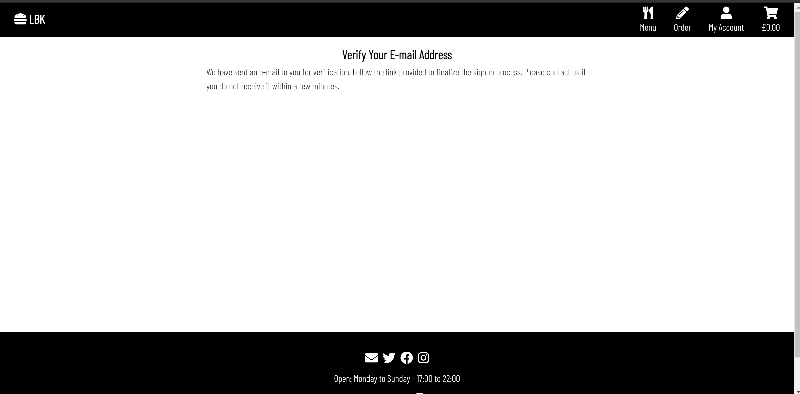
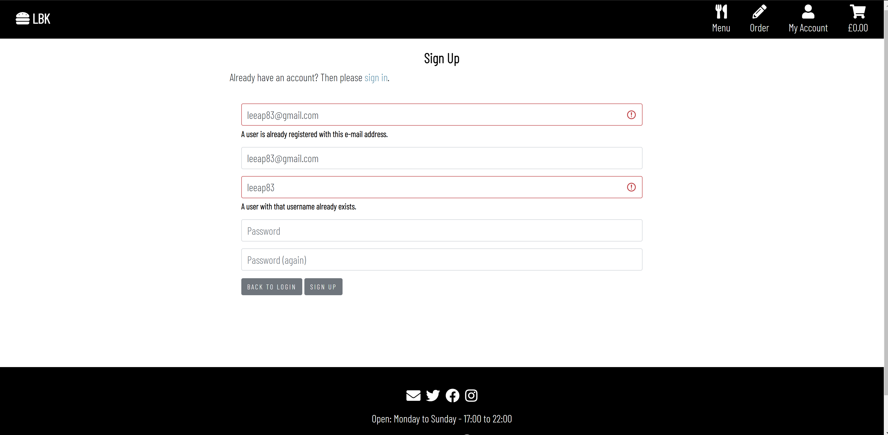
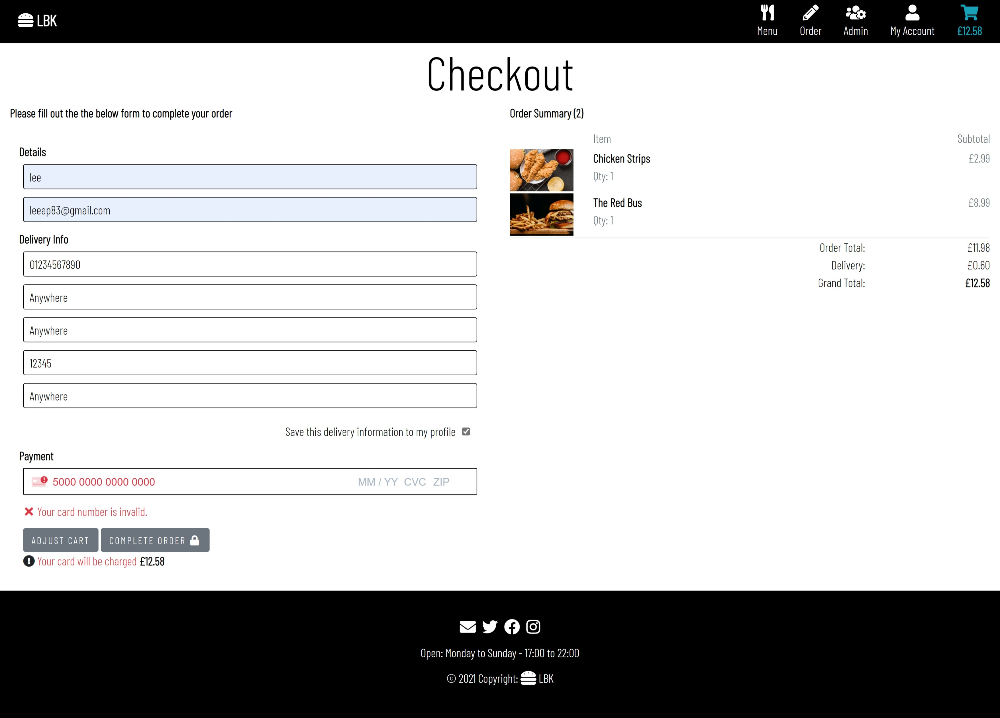
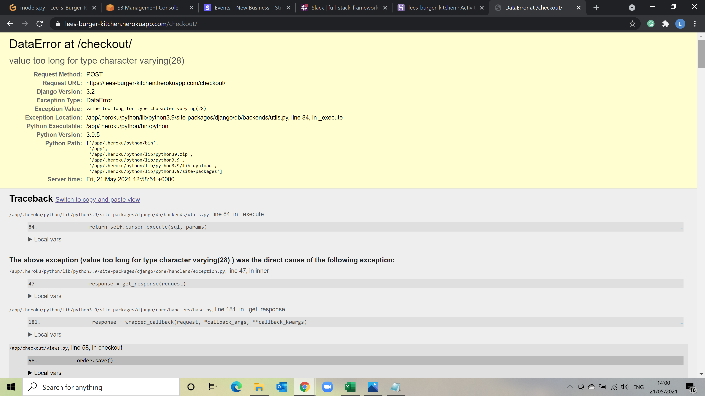

# Testing

### Code Validation
The Freeformatter HTML Validator and W3C CSS Validator were used to validate every page of the project to ensure there were no errors in the project.

### CSS
All CSS files were tested using [CSS Validator](http://jigsaw.w3.org/css-validator/) code passed validation [Results](documents/docs/css-results.pdf).

### HTML
All the HTML files were tested through [HTML Validator](https://validator.w3.org/). A number of errors showed but this was becuase the validator does not recognize Jinja2 templating language. There were also few minor errors regarding target="_blank" on some images on the index page which was removed from the code. Apart from that, no other errors were found across the html pages.

### Javascript
All the JS files and scripts were tested through [JSHint](https://jshint.com/), minor errors where semi colons were missing was highlighted and rectified.

### Python
The code was constantly checked to ensure it was PEP8 compliant where possible. The command "python3 -m flake8" was used to run through the list of any problems. There are a some lines of code that are too long these are in webhooks, settings and migrations which have been left. 

### Lighthouse
Lighthouse was used from Google Chrome Dev Tools to help improve perfomance and accessability. Audits were carried out on all pages [Results](documents/docs/lighthouse-results.pdf).

### Devices
The website was tested on laptop, desktop, iphone, ipad on the following browsers:
- Google Chrome
- Microsoft Edge
- Safari
- Firefox 

### Manual Testing 

Manual test were conducted on the functionality of the sites features and the user story 

### Responsive on all devices 
- Test:
    - The site was tested on mutiple browsers and different devices.
    - Chrome Dev Tools was used to check the sites responsiveness for all device sizes. 
    - Using Dev tools and mutiple devices each page was clicked to test the site on various resolutions sizes.
- Results:
    - Various issues were found such as the homepage animations created a blank space to the right of the screen on mobile devices this was fixed by using overflow hidden. Media queries were also used to fix styling issues on smaller screen sizes.
### **Homepage**
- Test:
    - The homepage animations were tested to ensure that when the page loads they work as expected.
    - The refresh button and the back button was tested to ensure the animations worked. 
    - The button links  on the homepage for Place Order, Our burgers, About us, our suppliers and reviews were all clicked.
- Results:
    - Animations loaded as expected everytime and the appropriate pages were returned as expected. 

#### Homepage - Place Order Button
- Test:
    - The Place order button was clicked. 
    - The close button was clicked and was returned to the homepage.
- Results:
    - When clicked the relevant page was returned. 
    - When clicked non-authenticated users were directed to the login page. 
    - When clicked authenticated users were directed to the place order view.
    - The close button when clicked returned user back to homepage.

#### Homepage - Our Burgers Section
- Test:
    - The view menu button in the our burger section was clicked.
    - The close button was clicked.
- Results:
    - The appropriate pages were returned after the button was clicked.

#### Homepage - About Us Section
- Test:
    - The about us button in the about us section was clicked.
    - In the about page the create your own burger button was clicked.
    - The close button was clicked.
- Results: 
    -  The appropriate pages were returned after the button was clicked.

#### Homepage - Our Suppliers Section
- Test:
    - The our suppliers button in the Fresh ingredients section was clicked.
    - The hyperlinks to all suppliers was clicked. 
    - The close button was clicked.
- Results: 
    - The appropriate pages were returned after the button was clicked.
    - When the hyperlink was clicke a new window opened and user was taken to the appropriate homepage for that company.

#### Homepage - Reviews Section 
- Test:
    - The reviews button in the Reviews section was clicked.
    - Test reviews were added to the database to ensure they appeared on the review screen. 
    - The review title was clicked on to display review details.
    - The close button was clicked.
    - The Add Review button was clicked to add a review.
- Results:
    - The appropriate pages were returned after the button was clicked.
    - Added reviews appeared as expected when created.
    - When the review title was clicked on the review details were displayed as a dropdown.
    - The add a review page was returned when the add review button was clicked.

#### Add Review Page
- Test:
    - The add review form was completed and submit button was clicked.
    - The reviews page was checked to ensure the review was displayed.
    - The database admin section was logged into to ensure review appearded in the database.
- Results:
    - After submitting the review was posted to the database and displayed on the reviews section.

### **Footer**
- Test:
    - The email icon was clicked.
    - The social links were all clicked to ensure that the relevant link opened in a new window.
    - The burger icon was clicked to ensure user was taken to homepage.
- Results: 
    - After clicking on email icon a new message window opened sending email to leesburgerkitchen@example.com.
    - When social link icon was clicked the appropriate social media hompage opens in a new window.
    - The burger icon when clicked returned user back to homepage.

### **Logo**
- Test:
    - The burger icon was clicked.
- Results:
    - When clicked the homepage was returned.

### **Navbar**
- Test:
    - Clicked on all the links in the navbar to enure they were pointing to correct page.
    - Tested navbar as guest user to ensure links were restricted.
    - Tested navbar signed in as a registered user to ensure appropriate links were available.
    - Tested navbar signed in as a superuser to ensure appropriate links were available.
    - Checked that the navbar on smaller devices looked ok.
- Results:
    - The designate page was returned when navbar link was clicked.
    - When using site as a guest some links when clicked directed user to login/register page.
    - When using site as a registered users those links that were blocked were now available for users.
    - When using site as a Superuser the Admin Icon appears for the user.

#### Navbar - Menu Button
- Test:
    - The Menu link in the navbar was clicked.
- Results:
    - After clicking the menu button all the products were returned.

#### Menu Page
- Test: 
    - Check that the burger animation works when page is loaded.
    - The search bar was tested by entering a word that matches the name or description, a word that doesnt match and a blank search query.
    - The category filters were tested by clicking each category.  
    - All cards were tested to ensure that when hovered or clicked that the product name, description, price and more info button are shown.
    - The cards were tested to ensure that when logged in as a superuser the edit and delete buttons are displayed.
    - The more info button was clicked

- Results:
    - The burger images combine to form a burger and the menu header appears when page is loaded or refreshed.
    - When a word queried in the search bar that matches a name or is contained in the description those items were returned. If a word doesn't match anything in the database no results are returned, and a blank query returns an error message appears advising user that they didnt enter a search criteria.
    - When the category types are clicked the products for that category are returned. 
    - When all cards were clicked on or hovered over the card expanded and the product name, description, price and more info button were displayed properly.
    - When logged in as a superuser hovering over a card displayed two extra buttons one to Edit and one to delete product.
    - When clicked the more info button returns the product details page. 

#### Product Details
- Test:
    - Ensure product image and text are displayed properly.
    - Clicked the close button.
    - Tested product details page as a guest user.
    - Tested product details page a registered user. 
    - Tested product details page a superuser. 
    - Clicked the quantity plus & minus buttons and typed amounts.
    - Clicked the Still Hungry button.
    - clicked the Add to cart button
- Results:
    - Product image and details were displayed correctly
    - When clicked the close button returned the user back to the homepage.
    - As a guest user the product details are displayed and they are advised to login or register to place an order.
    - As a registered user the product details are displayed and the quantity form, add to cart button and still hungry buttons are visable.
    - As a superuser the product details are similar to a registered user but additional edit and delete buttons are visable.
    - The quantity plus and minus buttons were clicked and the value increased and decreasde as expected.
    - When clicked the still hungry button returned the user back to the Menu page.
    - when the add to cart button was clicked the product was addeded to the cart.

#### Edit Button & Delete Buttons
- Test:
    - Clicked Edit buttons on Menu Page and Product Details Page.
    - Clicked Delete buttons on Menu Page and Product Details Page..
- Results:
    - When clicked the edit buttons the user was directed to the edit product page.
    - When clicked the delete button deletes the product from the site and the database.

#### Edit Product Page
- Test:
    - The close button was clicked
    - The category dropdown box shows all categories and allows user to change. 
    - The fields on the edit product form were tested and updated individually.
    - The select image was clicked
    - The remove button was ticked
    - The update button was clicked 
- Results: 
    - When clicked the close button directs the user back to the menu page.
    - The dropdown box displays all the categories and when selected the value changes in the box.
    - The Text fields allow you to overtype and change the current value.
    - When clicked the select image box opens a folder to allow the user to change image.
    - When the remove button was ticked and the update button clicked the current image is removed.
    - The update button when clicked updates the product details with the new fields ond images.

#### Navbar - Order Button
- Test:
    - The Order icon was clicked
- Results: 
    - When clicked a dropdown menu displays Place Order and Build your own links.

#### Navbar - Order - Place Order Page
- Test:
    - The Place Order button was clicked as a guest user.
    - The Place Order button was clicked as a registered user.
    - The add to cart button was clicked on all items to ensure they worked.
    - The plus button on the quantity was clicked to check it worked.
    - The minus button on the quantity it was tested to ensure that user can't enter an amount below one.
    - Amounts zero and less was typed into the quantity field to enusre user cant select an amount below one.
- Results:
    - When clicked as a guest user the login page is returned.
    - When clicked as a authenticated user the order page is returned.
    - When add to cart button was clicked the item was added and the appropriate item details appeared in the success message.
    - When clicked the plus button allowed user to select an amount from 1-999.
    - When clicked the minus button was disabled and would not let the user go below 1.
    - When an amount below one was typed in the field a warning message appeared advising the user they must enter a value equal or greater to 1.

#### Navbar - Order - Build Your Own Page
- Test:
    - The Build your Own link in the navbar was clicked.
    - Custom burger was created in the admin section of the database to ensure the burger was displayed properly. 
    - The Create your own burger button was clicked this was tested as a guest user and signed in as a registered user. 
- Results: 
    - When clicked the build your own page was returned which displayed the custom burger that had been created.
    - When the create your own button was clicked as a guest user they were redirected to the login page. and for authenticated users the create your own form was returned.
    - When the create your own button was clicked as a registered user they were redirected to the create your own page.

#### Build Your Own - Create Your Own Page
- Test:
    - Various Custom Burgers were created using the form, multiple ingredients were selected from the same category, custom name was inputted and the create burger button was clicked.
    - Tried to create a burger without adding a custom name.
    - The quantity buttons were clicked and numbers were typed in to the field
    - The add to cart button was clicked.
- Results:
    - Once the Custom Burger form was completed and the create burger button was clicked a success message to confirm burger was created. The create Your own page was checked to ensure the burger was created.
    - When the create burger button was cliked and the form complete the user would be kept on the page with a confirmation message that the burger was created allowing them to add to cart. 
    - When burger was created with no custom name the form couldn't be submitted and the user was asked to fill in this field.
    - The quantity plus and minus buttons worked again not letting user select or type an amount below 1.
    - When the add to cart button was clicked the user gets a message confirming that the custom burger has been added to the cart and the cart icon turns blue and shows the amount in the cart.  
- Bugs Found:
    - The ingredients on the the create your own page were grouped together and in no order, struggled to get them to split by category.
    - An Integrity Error occured when adding custom burger to cart.
- Solution: 
    - Changed the model to have the category types included as seperate fields instead of using one ingredient field. In the custom_form the ingredients wher then split by type using a queryset filtering the Ingredients model by the cat type. 
    - The Integrity Error was due to the price so a default price was added to the Custom_burger model.

#### Navbar - My Account - Non-authenticated
- Test:
    - My account was clicked as a guest user.
    - Clicked on register and completed the form.
    - Tried using the same email address or username as already created users.
    - The signin functionality was tested by logging in with created users and tested using incoorect username and passwords.
    - The forgot password link on the login was tested to change the password of an existing user.
- Results:
    - When clicked the dropdown menu of register and login were displayed.
    - When registration form was completed a confirmation screen appears advising user that an email was sent for verifying the account . 
    - The email vaerification link was clicked and account was created and directed to login page.
    - When registering and using an email address or a username that already exist the user is greated with an error mesage advising the user is already registered. 
    - When Login link in the navbar was clicked the user was directed to the login page.
    - When Username or password was incorrectly entered a message advising the user that they have entered incorrect details.
    - When forgot my password link was clicked the user was asked to enter the email address, an icoorect email returned a warning advising that the email address was not assigned. A correct email sent a link to reset password and the user is shown a screen advising that a password reset email was sent. 
    

#### Navbar - My Account - Authenticated
- Test:
    - The logout link was tested to ensure that the logout page was returned.
    - The My Profile link was tested to ensure that the correct profile page and user information was returned.
    - The Update Profile button was clicked.
    - Changing the username, email address, delivery info and profile picture were all tested. 
    - The order id in the order history of the profile page was clicked.
- Results: 
    - When logout is clicked the user is directed to a confirmation screen the logout button was clicked and user was successfully logged out and returned to the homepage. The cancel button was clicked and the user stayed logged in and was sent to the homepage.
    - When My Profile was clicked the profile page was displayed showing the correct user information.
    - When the update profile button was clicked the update form is returned with the existing user information returned.  
    - The username, email address, delivery info and profile picture were all changed when the existing info was changed and the update button clicked.
    - When order id was clicked the order confirmation along with a message confirming this is an old order is displayed.

#### Navbar - Cart
- Test:
    - The shopping cart link was clicked with an empty cart.
    - The shopping cart link was clicked with items added to the cart. 
    - The quantity plus and minus buttons were clicked to increase and decrease the amount.
    - The update button was clicked to enure the new value was updated.
    - The remove buttons was clicked to test that the product was removed.
    - Click on Still Hungry button.
    - The Secure Checkout button was clicked. 
- Results:
    - When clicked with an empty cart the user is greeted with a screen confirming the cart is empty and a still hungry? button when clicked returned the Menu page.
    - When clicked with items in the cart the shopping cart shows the product image, name, price, quantity, subtotal, cart total, delivery costs, grand total, Still Hungry? button which takes users back to the menu page and secure checkout button.
    - When Items are added to cart a success message appears with confirmation of the product name added to the bag and a break down of items in the cart and a subtotal. The iocn and amount on the navbar changes colour and the amount displays the total of the cart.
    - When the plus and minus buttons were clicked the value would increased or decreased.
    - When the update button was clicked the item quantity is updated to the new value and the subtotal is updated to the correct value.
    - When remove is clicked the item is removed from the cart and the success message confirms product was removed. If more items in the cart the totals are updated to correct value, if cart is empty user gets your cart is empty message.
    - The menu page was returned when the still hungry button was clicked.
    - When the secure checkout button was clicked the checkout page was loaded.    

#### Checkout Page 
- Test:
    - Verify that the order summary displays the right text and images.
    - Test the save delivery information tick box saves the delivery info to profile.
    - Test that the saved delivery information from profile page is returned on next purchased.
    - Tried to complete order with empty fields for details, delivery infor and payment.
    - In payment section tried completing an order using card number 4242 4242 4242 4242 with a 04/24 as expiration and 242 as cvc.
    - Tested payment section with incorrect card numbers, expiry dates and cvc. 
- Results:
    - Order summary displayed the correct text and images.
    - After payment was completed My profile was checked and the delivery information was saved.
    - Added another item to the cart and clicked on secure checkout and the saved delivery info from profile page was displayed in the delivery info on the checkout page.
    - When completing orders with incomplete fields the order isn't processed and the blank field displays a text buble with an exclamation mark asking user to complete this field. When details and delivery info is filled in but payment is blank the complete order tries to process but returns the checkout with an error message under the card number advising the payment is incomplete.   
    - Using 4242 4242 4242 4242 card number results in a successful transaction which is confirmed in the stripe dashboard. 
    - After a valid payment the user is directed to an order confirmation page which displays order details and delivery details and a confirmation email was recieved.
    - The users profile page order history was checked and the confirmed order is visible.
    - The confirmed order appears in the database under the orders section.
    - When incorrect card details were tested the payment cant be processed and an error appears 

#### Navbar - Admin
- Test:
    - Clicked on the admin link in the navbar
- Results:
    - When clicked the admin reveals a dropdown displaying add product, today's orders and order history.

#### Navbar - Admin - Add Product
- Test:
    - The Add Product link was clicked.
    - The Add product form was tested.
    - The Add product button was clicked. 
- Results:
    - When clicked add product link the add product form was returned.
    - When completing the add product form, fields with astrix were left blank when submitting the form and the form was not valid and was not processed. 
    - If form is valid when add product button is clicked the product is added to the database and the user is directed to the new product details.
    - After completing the form the product was searched for using the search bar on the menu page and the new product was returned.
    - The edit and delete buttons were additionally tested at this point, when deleted the product was searched for to ensure it was removed.

#### Navbar - Admin - Today's Orders
- Test:
    - Make sure orders for the day are displayed with relevant information.
    - The total orders for the day displays the correct amount.
    - The total revenue displays the correct amount.
    - When order is clicked the correct order information is returned.
    - Check that order status can be updated.
    - When orders are created active orders and completed orders are shown in the relevant tables.
- Results:
    - Orders were added to the database by testing the checkout functionality by multiple users and the order and relevant information was displayed.
    - When orders were added the today's orders were checked and the total of orders was displaying the correct amount.
    - When orders were added the today's orders were checked and the total revenue was displaying the correct amount.
    - The order when clicked on returned the correct order details.
    - The order details allows the user to update the order status, each option was selected and updated. These changes fed through to the table with the updated value.
    - Orders changed to recievied, cooking and out for delivery stayed in the active orders and orders changed to delivered moved to the completed table.  
- Bugs Found:
    - The table information was to much for mobile smaller screen sizes and needed to scroll left to right to see the information.
- Solution:
    - The information displayed was shortened to the important information to reduce the room required on the screen. 

#### Navbar - Admin - Today's Orders
- Test:
    - Click on order history link to ensure directed to correct page.
    - Use search bar to search for name, email, status and order at.
    - Click on the reset button to check that all orders are returned and the search query is reset. 
    - Clicked on order to check if correct order details are returned.
- Results:
    - When clicked the order history link returns the order history page was returned displaying all orders.
    - The search bar was used on the order history searching for order id, name, email, status and order at and the relevant order/orders was returned. 
    - The reset button was clicked and all orders were returned.
    - When the order is clicked the order details are returned.

### **Back to Top**
- Test:
    - The back to top was clicked on relevant pages 
- Results:
    - When clicked the back to top button returned users back to the top 

## Testing User Stories

**External User Goals:**

As a User....
*  I expect to access the website from any device, so that I can use the website anytime and anywhere.  
    (a)  The website has been developed to be mobile responsive and can be used accross multiple platforms.

*  I expect to easily navigate the website, so that I can quickly find what I'm looking for.  
    (a)  The Navbar helps users navigate the site.   
    (b)  Close buttons allows usere the ability to go back to previous page.

*  I want to find an information about the company, to know what they do, what their main principles and ideas.  
    (a)  The About us section gives the users some additional information about the company.

*  I want to see the location of the LBK.  
    (a)  The Address of LBK can be found on the About us section.

*  I want to be able to easily contact the owner/manager of the company, so that I can write an additional query or ask a question.  
    (a)  The User can click on the email icon in the social link to send emails to LBK.  
    (b)  LBK telephone number can be found in the contact us section of the about us page.  
    (c)  The email address can be found on the confirmation email in case there is a problem.

*  I want to view all available products.  
    (a)  The Menu page allows useres to see all products and can be filtered by category type.  
    (b)  The Order page allows users to see a simplistic menu page of all products.

*  I want to view product details (e.g. image, price, description, ingredients), so that I can make an informed decision before I buy.  
    (a)  The menu page gives the user brief information about the product.  
    (b)  The more info button takes users to the product details page where more information can be found.  
    (c)  The place order page gives the user simplistic but relevant information about the product.

*  I want to search and filter the products easily, so that I can quickly find a specific product I am looking for.  
    (a)  The Menu page allows the users to search for keywords that are either in the name or in the description of the product.  
    (b)  The User can narrow down the product based on category type in the menu section.

*  I want to view and modify my order in the cart before completing it, so that I can make last changes easily before proceeding to payment.  
    (a)  Users can update and remove items from their cart in the shopping cart screen.  
    (b)  Users can continue to shop if they have missed an item by using the still hungry button.

*  I want to view a total price of my purchases and delivery cost, so that I will understand and see how much I will be charged.  
    (a)  The shopping cart and the checkout page clearly breakdown the cost by subtotal, order total, delivery costs and a grand total.  
    (b)  Underneath the payment section in the checkout it clearly states the total the card will be charged.  
    (c)  When adding items to cart the user is greeted with a success message which informs the user the cost excluding delivery.  
    (d) The Cart Icon in the Navbar shows the user the subtotal of their cart at all times.

*  I want to receive an email confirmation after checkout, so that I can make sure that payment was successfull.  
    (a) on succesful completion the user recieves an order confirmation.

### New Users
As a new user....
* I want to create my own account, so that I can save, view and edit my profile details and view my order history.  
    (a)  The all auth allows users the ability to create an account using the register.  
    (b)  When logged in the user can view their account at all time by clicking my account and my profile.  
    (c)  The user can update their info and profile picture using the update profile button in my profile page.  
    (d)  The user can see all their orders on the profile page and by clicking the order id for more detail.

### Returning users
As a returning user....
*  I want to easily login anytime, so that I can get access to my saved profile details and make next purchase quicker.  
    (a)  The user can tick the remember me on the login page for easy access.  
    (b)  On completion of first order the user can tick to store their information to their profile page which will autofilled on next purchase.  
    (c)  The user can enter their information to their profile page which will be used as default against purchases.
*  I want to reset my password if I forgot it, so that I can get access to my profile again.  
    (a)  The user can reset their password via the login section by clicking forgot password.
*  I want to be able to change my password, so that I can create the stronger password to protect my personal details.  
    (a)  The user can reset their password via the login section by clicking forgot password.
*  I want to be able to change my email.  
    (a) The user can update email address by accessing their profile page and clicking update profile.

 
### Website Owner(admin)
As a Site owner....
*  I want to secure admin interface avalable only for website admin, so that I can add, edit and remove products.  
    (a)  Superusers can access the stores admin page to access the database.  
    (b)  Superusers can add products throurgh the Admin section of the Navbar.  
    (c)  Superusers can edit and delete particular products through the menu page and/or the product details page.   
*  I want to be able to view orders recieved  for that day and update the order status.  
    (a)  Superusers can see all orders for that day by using the Todays orders in the Admin section of the navbar.
*  I want to be able to differentiate between active orders and completed orders for the day.  
    (a)  The order dashboard is split into two tables the top for active the bottom for completed.  
    (b)  The order status in the dashboard confirms the status of the order.
*  I want to be able to view history of all orders received.  
    (a)  Superusers can see the complete order history by clicking the Order History in the admin section of the navbar.

  
## Bugs
### Image Links
#### Bug
After deploying to Heroku Menu image links were broken as the file url wasn't included in the media folder upload.
#### Fix 
These were added in the admin section.

### Server Error 500
#### Bug
After deploying a Server Error 500 message appeared after confirming payment in the checkout app . 
#### Fix
This error was due to the order_id in the models.py having a max-length of 28 when the UUID is 32 characters. This issue was corrected and migrations where ran but the error still occured. After contacting Tutor support it was highlighted that there were existing orders in the developembntal database that was causing this error. These orders were deleted from the admin section, the postgress database was reset and the data was dumped into jason.db and reimported.

### Integrity Error
#### Bug
After creating the Custom_burger creator an integrity Error occured on the Heroku app when clicking the create burger button.
#### Fix
This error was resolved by adding a price field in the Custom_burger model and giving it a default value.
